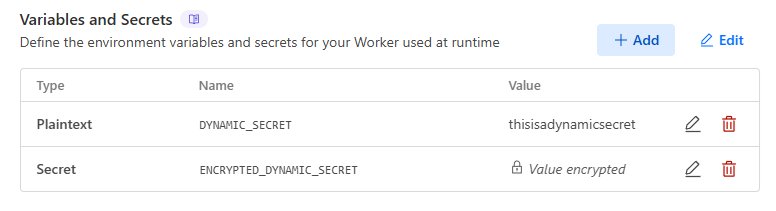

# Sveltekit + Rolldown + Cloudflare Workers ✅

Making demo for testing purposes :check:

## Enviroment Variable

### Format

For the sake of portability (and sanity), environment variable names must consist solely of letters, digits, and the underscore ( \_ ) and must not begin with a digit. In regex-speak, the names must match the following pattern:

```re
[a-zA-Z_]+[a-zA-Z0-9_]\*
```

### Example

```yaml
# Static
PUBLIC_API_KEY=publicsecrethere
FLAGS_SECRET=secrethere
DEEP_SECRET=deepsecrethere

# Dynamic
DYNAMIC_SECRET=deepsecrethere
ENCRYPTED_DYNAMIC_SECRET=deepsecrethere
```

## Declaring Enviroment Variables

There is a caveat, you are able to declare enviroment variables at `runtime` or `build`

### Build

When you declare variables at `build`, the only way to access it is by importing the enviroment variables the following way:

```javascript
import { PUBLIC_API_KEY } from '$env/static/public';
import { FLAGS_SECRET, DEEP_SECRET } from '$env/static/private';

export function GET() {
	return json({
		publicKey: PUBLIC_API_KEY,
		unencryptedSecret: FLAGS_SECRET,
		cloudflareEncryptedSecretKey: DEEP_SECRET,
		requestDate: new Date().getUTCMilliseconds()
	});
}
```

### Runtime



When you declare variables at `runtime`, the only way to access it is by importing the enviroment variables the following way:

```javascript
import { env } from '$env/dynamic/private';

export function GET() {
	return json({
		unencrypted: env.DYNAMIC_SECRET,
		cloudflareEncryptedDyanmicKey: env.ENCRYPTED_DYNAMIC_SECRET
	});
}
```

## Build Config


