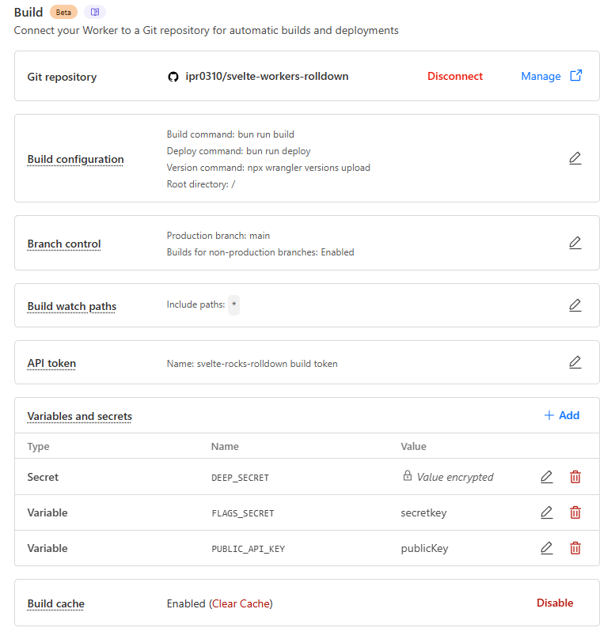
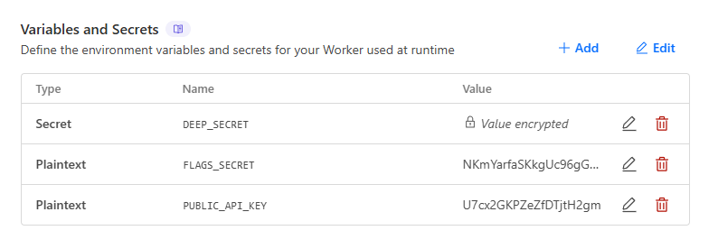

# Sveltekit + Rolldown + Cloudflare Workers ✅

Making demo for testing purposes :check:

## Enviroment Variable

### Format

For the sake of portability (and sanity), environment variable names must consist solely of letters, digits, and the underscore ( \_ ) and must not begin with a digit. In regex-speak, the names must match the following pattern:

```re
[a-zA-Z_]+[a-zA-Z0-9_]\*
```

### Example

```yaml
PUBLIC_API_KEY=publicsecrethere
FLAGS_SECRET=secrethere
DEEP_SECRET=deepsecrethere

DYNAMIC_SECRET=deepsecrethere
ENCRYPTED_DYNAMIC_SECRET=deepsecrethere
```

## Build Config

There is a caveat, you must declare enviroment variables only at `build`, otherwise build may no succeed or variables not be correctly read

### Build (Declare it Here) ✅



### Runtime (Do NOT Declare it here) ❌


